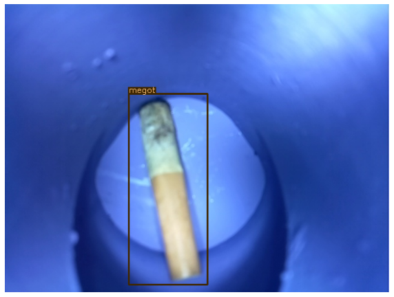

# Birds For Change 

## Détection de déchets par Deep Learning

Ce projet regroupe les développements effectués par [`IFP Energies nouvelles (IFPEN)`](https://www.ifpenergiesnouvelles.fr/) pour la détection
de déchets dans des images typiquement issues d'automates mis en place par 
[`Birds For Change (BFC)`](https://www.birdsforchange.fr/).

## Jeu de données

Ensemble de jeux de données annotées par `BFC` disponibles :
* [`megots150images.zip`](data/megots150images.zip) : archive de 147 images de mégots de cigarette

Les jeux de données sont au format [Pascal VOC XML](http://host.robots.ox.ac.uk/pascal/VOC/). 
Ce format peut typiquement etre généré par l'outil [Label Studio](https://labelstud.io/)

## Demonstrateur 

Un démonstrateur utilisant [`detectron2`](https://github.com/facebookresearch/detectron2) construit sur 
[`PyTorch`](https://github.com/pytorch/pytorch) est disponible dans un
notebook mis au point sur [`Google/Colab`](https://colab.research.google.com/). 
Voir [ici](https://colab.research.google.com/github/googlecolab/colabtools/blob/master/notebooks/colab-github-demo.ipynb#scrollTo=Rmai0dD30XzL)
pour les détails d'intégration.

[Demonstrateur - apprentissage par detectron2 pour la détection de mégots](https://github.com/thibocour/IA/blob/master/notebooks/detectron2.ipynb)
## Entrainement Coral TPU

Coming soon !! 

## Ressources en vrac

* https://colab.research.google.com/
* http://host.robots.ox.ac.uk/pascal/VOC/
* https://labelstud.io/
* https://pytorch.org/docs/stable/index.html
* https://github.com/pytorch/pytorch
* https://pytorch.org/tutorials/
* https://pytorch.org/ecosystem/
* https://github.com/facebookresearch/detectron2
* https://ai.facebook.com/blog/-detectron2-a-pytorch-based-modular-object-detection-library-/
* https://detectron2.readthedocs.io/en/latest/index.html

## Contacts

email : [birdsforchange](mailto:contact@birdsforchange.com)

auteurs : [@thibocour](https://github.com/tibocour), [@sdesrozis](https://github.com/sdesrozis)

